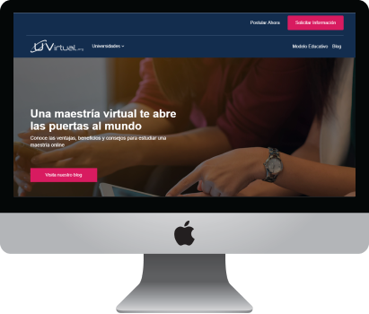

# UVirtual

## Antecedentes

UVirtual, es una empresa de educación que se dedica a las ventas de programas especializados, máster, maestrías de manera virtual. Actualmente ellos trabajan con tres universidades importantes en el mundo: Universidad Salamanca (España), Universidad Marcony (Italia) y Universidad Arturo Prat (Chile).

## Objetivo

Mejorar la experiencia del usuario al momento de registrarse a la postulación en un programa de máster o magíster de la Universidad que corresponda.
El sistema debe permitir que el usuario se registre ordenadamente y sin dificultad a la maestría de su elección.

## Benchmarking

Las diferentes universidades utilizan plataformas **e-learning o LMS** (Learning Management System) muy sofisticados y con tecnología de punta, para el dictado de sus programas de posgrado o cursos de especialización.

**Fuente:** [El Comercio](https://bit.ly/2GNfK7L "El Comercio")

### Competencia a nivel Nacional

#### ESAN:

* Cuenta con una plataforma **Blackboard Collaborate Ultra**, que es un sistema e-learning colaborativo que permite tener clases síncronas (en tiempo real) de una maestría **simple**, **cómoda** y **confiable**.
* Dicta especializaciones para **ejecutivos**.
* Es independiente del sistema operativo que se utilice, suficiente con acceso a internet.

#### UPC:

* También usa la herramienta **Blackboard** y además está implementado a sistemas adaptativos de aprendizaje, el cuál permite mayor flexibilidad al proceso.
* Trabaja con un sistema de **gestión de perfiles de los estudiantes** y **seguimiento de adquisición de competencias**, todo se registra en un **portafolio electrónico.**

#### USIL:

* Cuenta con la modalidad **blended** o semivirtual.
* Para la interacción (virtual), utiliza herramientas síncronas como las videoconferencias, y asíncronas como los foros y wikis.         

### Análisis Comparativo a nivel Internacional:

Para el análisis comparativo se uso los siguientes parámetros **Usabilidad**, **Branding** y **Contenido**, dando puntajes de 1 al 10.

**Fuente:**[Wayra](https://goo.gl/Ti2KCT "Wayra")

### Competencia a nivel Nacional:

#### 2U:

* Plataforma que ofrece cursos online, creado por prestigiosas universidades como **Oxford**, **Harvard** o **Georgetown**.
* En muchos casos combinan lo mejor de la educación online con lo mejor de la educación presencial.
* Su sistema educativo tiene una combinación de tecnología y servicios de apoyo a los estudiantes.
* Ha logrado una retención estudiantil del **84 %** en alumnos de distintas partes del mundo.

**Fuente:** [2u vs UVirtual](https://bit.ly/2Mk2HNf "2u vs UVirtual")

#### GetsMarter:

* GetSmarter, una subsidiaria de propiedad total de 2U, Inc.
* Se asocia con las principales universidades del mundo para seleccionar, diseñar y ofrecer **cursos breves** en **línea premium** con un enfoque basado en los datos en la **ganancia de aprendizaje**.

**Fuente:** [GetsMarter vs UVirtual](https://bit.ly/2MfOp0V "GetsMarter vs UVirtual")

#### Unir.net:

* Universidad en línea: cursos de grado, postgrado y máster en línea reconocidas en la unión europea.
* Emplean la metodología e-learning innovadora.

**Fuente:** [Unir.net vs UVirtual](https://bit.ly/2Oydkt2 "UVirtual vs Unir.net")

### Análisis Comparativo a nivel Internacional:

Para el análisis comparativo se uso los siguientes parámetros **Usabilidad**, **Branding** y **Contenido**, dando puntajes de 1 al 10.

**Fuente:**[Wayra](https://goo.gl/Ti2KCT "Wayra")

## Estructura

La estructura planteada comprende

## Flujo del usuario
